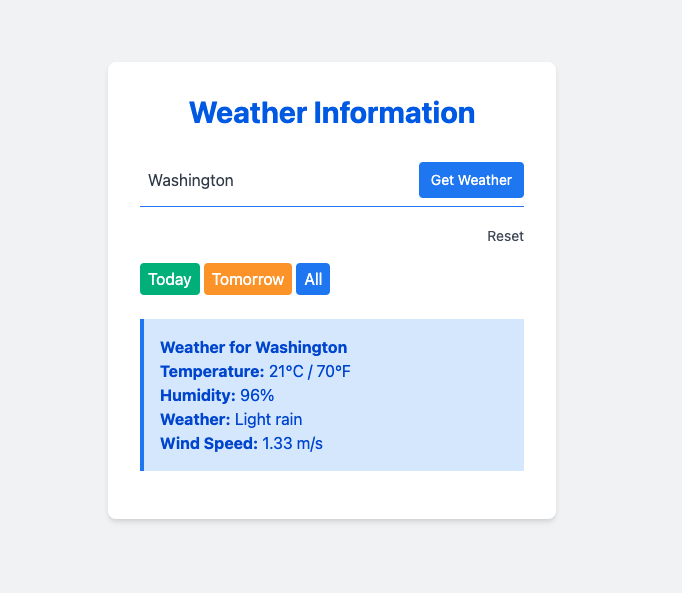

# Weather Forecast Application

This is a simple PHP-based weather forecast application that uses the OpenWeatherMap API to fetch and display weather information for a specified city. The application features caching and logging to improve performance and facilitate debugging.

## Features

- **Weather Forecast**: Get current, today, and tomorrow's weather forecasts for any city.
- **Caching**: Reduces the number of API calls by caching weather data locally.
- **Error and Info Logging**: Separate logs for errors and informational messages.
- **Responsive UI**: Uses Tailwind CSS for a responsive and modern UI design.

## Technologies Used

- **PHP**: Backend language used to process API requests and responses.
- **Guzzle**: HTTP client for making API requests.
- **OpenWeatherMap API**: Provides weather data for the application.
- **Tailwind CSS**: Utility-first CSS framework for designing the frontend.
- **Composer**: Dependency manager for PHP.
- **Git**: Version control system for tracking changes.

## Project Structure

```bash
    task_1/
    │
    └─── src/
        └─── Config/
        │    └── config.php                # Configuration file for API keys and settings
        └─── Logs/
        │    └── error.log                 # Error logs
        │    └── info.log                  # Informational logs
        └─── Public/
        │    └── index.php                 # Main entry point for the application
        └─── Services/
        │    └── CacheService.php          # Caching service class
        │    └── LoggerService.php         # Logging service class
        │    └── WeatherService.php        # Weather service class for API interaction
        └─── Storage/
            └── weather_cache.json        # Cached weather data
    /vendor/                               # Composer dependencies
    .gitignore                             # Files and directories to be ignored by Git
    README.md                              # Project overview and instructions
```

# Project overview and instructions

## Screenshots




## Getting Started

### Prerequisites

- **PHP 7.4 or higher**
- **Composer**: Dependency manager for PHP
- **OpenWeatherMap API Key**: Required to fetch weather data.

### Installation

1. Clone the repository:
    ```bash
    git clone https://github.com/alexTriolla/task_1.git
    cd task_1
    ```

2. Install Composer dependencies:
    ```bash
    composer install
    ```

3. Configure the application:
   - Rename `config.example.php` to `config.php` in the `src/Config` directory.
   - Add your OpenWeatherMap API key in `config.php`:
     ```php
     define('API_KEY', 'your_api_key_here');
     ```

4. Start the PHP development server:
    ```bash
    php -S localhost:8000 -t src/Public
    ```

5. Open the application in your browser:
    ```
    http://localhost:8000
    ```

## Usage

1. Enter a city name in the input field and click "Get Weather" to fetch the forecast.
2. Use the "Today" and "Tomorrow" buttons to filter the forecast.
3. Check the `src/Logs/` directory for error and informational logs.

## Contributing

Feel free to submit issues or pull requests if you would like to contribute to this project.

## License

This project is licensed under the MIT License - see the [LICENSE](LICENSE) file for details.


